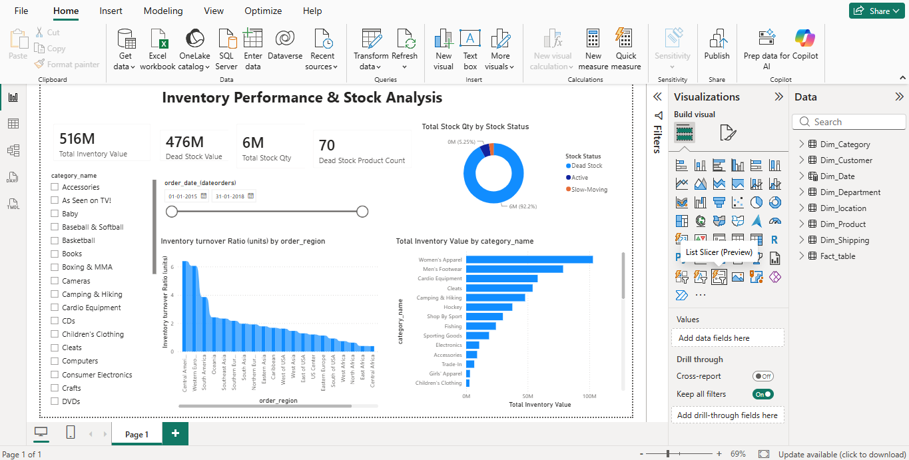

# Milestone 2: Supply Chain Visibility & Optimization

## 📊 Project Overview
This milestone delivers an end-to-end **Inventory Analytics** and **Delivery Performance** solution built using Microsoft Power BI. It empowers supply chain managers to monitor stock efficiency, minimize capital tied up in dead stock, and evaluate logistics fulfillment risks.

---

## 🖼️ Dashboard Preview

### 1. Inventory Analytics Dashboard


### 2. Delivery Performance Dashboard


---

## 📐 Methodologies & DAX Logic

### 1. Inventory Turnover Calculation Approach
* **Formula:**
  $$\text{Inventory Turnover} = \frac{\sum(\text{Sales})}{\text{Average}(\text{Inventory Value})}$$
* **DAX Implementation:**
  ```dax
  Turnover Rank Category = 
  RANKX(
      ALL(Fact_table[category_name]), 
      DIVIDE(SUM(Fact_table[sales]), AVERAGE(Fact_table[inventory_value]), 0), 
      , 
      DESC
  )
